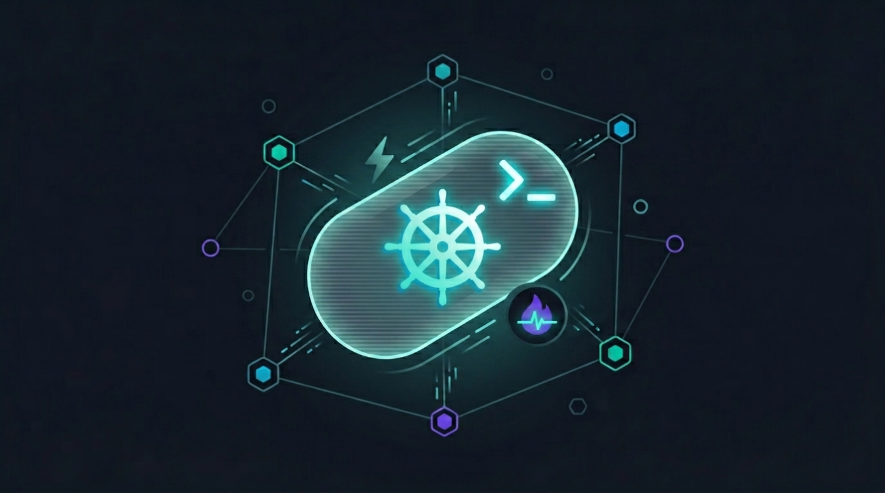

# 🚀 helm-in-pod

<p align="center">
  
</p>

> ⚡ A Helm plugin to run any command (helm/kubectl/etc) inside a Kubernetes cluster

---

## 📑 Table of Contents

- [Why?](#-why)
- [Requirements](#-requirements)
- [Installation](#-installation)
- [Daemon Mode](#-daemon-mode)
- [Usage](#-usage)
- [Environment Variables](#-environment-variables)
- [How It Works](#️-how-it-works)
- [RBAC / Cluster Resources](#-rbac--cluster-resources)
- [Examples](#-examples)
- [Purge](#-purge)
- [Development](#-development)

---

## 🤔 Why?

<details>
<summary>📡 <strong>Network Latency Problem</strong></summary>

When `helm` runs commands from your local machine, network latency to distant Kubernetes clusters can significantly slow down operations, especially with large releases containing many manifests.

**helm-in-pod** solves this by running Helm commands directly inside the cluster, minimizing network latency between the client and Kubernetes API.

</details>

### ✨ Key Benefits

| Feature                      | Description                                         |
|------------------------------|-----------------------------------------------------|
| 🏃‍♂️ **Fast Execution**     | Run commands inside the cluster for minimal latency |
| 🔧 **Any Command**           | Execute helm, kubectl, or any other command         |
| 📦 **Repository Sync**       | Automatically copies all host Helm repositories     |
| 📁 **File Transfer**         | Copy files/folders from host to pod                 |
| 🌍 **Environment Variables** | Set custom environment variables in the pod         |
| 🐳 **Custom Images**         | Use any Docker image for execution                  |
| 💾 **Volume Mounts**         | Mount PVCs, secrets, configmaps, and more into pods |
| 🔍 **Dry Run**               | Preview pod specs as YAML before creating anything  |

---

## 📋 Requirements

- 🎯 **Helm 3 or Helm 4** installed on host machine

> 💡 The plugin detects Helm 4 at runtime and automatically adjusts repository sync behavior accordingly. No manual configuration is needed.

### 🖥️ Supported Platforms

| OS      | Architecture |
|---------|-------------|
| Linux   | amd64, arm64 |
| macOS   | amd64, arm64 |
| Windows | amd64, arm64 |

---

## 🚀 Installation

<details>
<summary>📥 <strong>Quick Install/Update</strong></summary>

**For Helm 4:**
```bash
# Install or update the plugin
(helm plugin uninstall in-pod || true) && helm plugin install --verify=false --version=main https://github.com/Noksa/helm-in-pod
```

**For Helm 3:**
```bash
# Install or update the plugin
(helm plugin uninstall in-pod || true) && helm plugin install --version=main https://github.com/Noksa/helm-in-pod
```

> 💡 You can specify any existing version from the releases page

</details>

---

## ⚡ Daemon Mode

> 🔥 **Run multiple commands without pod recreation overhead!**

```bash
# Start once
helm in-pod daemon start --name dev --copy-repo

# Execute many times - INSTANT! ⚡
helm in-pod daemon exec --name dev -- "helm list -A"
helm in-pod daemon exec --name dev -- "helm upgrade myapp ..."

# Or open an interactive shell 🐚
helm in-pod daemon shell --name dev

# Check on your daemons 📊
helm in-pod daemon list
helm in-pod daemon status --name dev

# Stop when done
helm in-pod daemon stop --name dev
```

**10x faster** for multiple operations! Perfect for CI/CD, interactive development, and batch deployments.

> 💡 Set `HELM_IN_POD_DAEMON_NAME` environment variable to avoid repeating `--name` on every command. See [DAEMON.md](DAEMON.md) for details.

👉 **[Read Full Daemon Mode Documentation](DAEMON.md)**

---

## 📖 Usage

### 🔍 Getting Help

```bash
helm in-pod --help
```

### 🎯 Basic Syntax

```bash
helm in-pod exec [FLAGS] -- "COMMAND"
```

> 💡 `run` is an alias for `exec`: `helm in-pod run [FLAGS] -- "COMMAND"`

### 🔧 Available Flags

#### Global Flags

| Flag              | Description                                                        |
|-------------------|--------------------------------------------------------------------|
| `--verbose-logs`  | Enable debug logs                                                  |
| `--timeout`       | Gracefully terminate command after duration (default: 2h at runtime) |

> ⚠️ **Note**: For `exec` and `daemon start`, the plugin adds 10 minutes to the specified `--timeout` internally for pod operations (startup, file copy, etc.). For example, `--timeout 2h` results in a total pod lifetime of 2h10m. In `daemon exec`, the timeout applies directly to command execution with no additional overhead. See [DAEMON.md](DAEMON.md#️-timeout-behavior) for details.

#### Pod Creation Flags

| Flag                  | Short | Description                                                                  |
|-----------------------|-------|------------------------------------------------------------------------------|
| `--image`             | `-i`  | Docker image to use (run `helm in-pod exec --help` for current default) |
| `--cpu-request`       |       | Pod's CPU request (default: `1100m`)                                          |
| `--cpu-limit`         |       | Pod's CPU limit (default: `1100m`)                                            |
| `--memory-request`    |       | Pod's memory request (default: `500Mi`)                                       |
| `--memory-limit`      |       | Pod's memory limit (default: `500Mi`)                                         |
| `--create-pdb`        |       | Create PodDisruptionBudget (default: true)                                   |
| `--tolerations`       |       | Pod tolerations for node taints                                              |
| `--node-selector`     |       | Pod node selectors for node targeting                                        |
| `--host-network`      |       | Use host network in pod                                                      |
| `--run-as-user`       |       | User ID for security context                                                 |
| `--run-as-group`      |       | Group ID for security context                                                |
| `--labels`            |       | Additional labels on the pod                                                 |
| `--annotations`       |       | Additional annotations on the pod                                            |
| `--image-pull-secret` |       | Image pull secret for private repositories                                   |
| `--pull-policy`       |       | Image pull policy (default: `IfNotPresent`)                                  |
| `--volume`            |       | Mount volumes in the pod (repeatable). Format: `type:name:mountPath[:ro]`. Types: `pvc`, `secret`, `configmap`, `hostpath` |
| `--service-account`   |       | Service account for the pod (default: `helm-in-pod`)                         |
| `--dry-run`           |       | Print the pod spec as YAML without creating anything                         |
| `--active-deadline-seconds` | | Maximum duration in seconds the pod is allowed to run. Kubernetes terminates the pod once this deadline is exceeded, regardless of whether the client is still connected. Useful to avoid orphaned pods in CI/CD pipelines. `0` means no deadline (default) |

<details>
<summary>⚠️ <strong>Deprecated Flags</strong></summary>

The following flags still work but are deprecated and will be removed in a future release:

| Deprecated Flag | Replacement                          |
|-----------------|--------------------------------------|
| `--cpu`         | `--cpu-request` and `--cpu-limit`    |
| `--memory`      | `--memory-request` and `--memory-limit` |

When using a deprecated flag, its value is applied to both the request and limit. You cannot combine deprecated flags with their replacements (e.g., `--cpu` with `--cpu-request` will error).

</details>

#### Runtime Flags

| Flag                     | Short | Description                                             |
|--------------------------|-------|---------------------------------------------------------|
| `--copy`                 | `-c`  | Copy files/folders from host to pod                     |
| `--env`                  | `-e`  | Set environment variables                               |
| `--subst-env`            | `-s`  | Substitute environment variables from host              |
| `--copy-repo`            |       | Copy existing Helm repositories to pod (default: true)  |
| `--update-repo`          |       | Update specified Helm repositories                      |
| `--copy-attempts`        |       | Retry count for copy actions (default: 3)               |
| `--update-repo-attempts` |       | Retry count for repo update actions (default: 3)        |
| `--copy-from`            |       | Copy files/dirs from pod to host after execution (repeatable). Format: `/pod/path:/host/path` |

---

## 🌍 Environment Variables

| Variable                   | Description                                                                 |
|----------------------------|-----------------------------------------------------------------------------|
| `HELM_KUBECONTEXT`         | Override the Kubernetes context used by the plugin. When set, the plugin connects to this context instead of the current default. |
| `HELM_IN_POD_DAEMON_NAME`  | Default daemon name for `daemon` subcommands, so you can omit `--name`. See [DAEMON.md](DAEMON.md). |

---

## ⚙️ How It Works

<details>
<summary>🔄 <strong>Execution Flow</strong></summary>

When you run `helm in-pod exec`, the following happens:

1. 🏗️ **Pod Creation**: Creates a new `helm-in-pod` pod in the `helm-in-pod` namespace
2. 📚 **Repository Sync**: Copies all existing Helm repositories from host to pod (Helm 4 sync is detected and handled automatically)
3. 🔄 **Repository Updates**: Fetches updates for specified repositories
4. 📁 **File Transfer**: Copies specified files/directories to the pod
5. ▶️ **Command Execution**: Runs your specified command inside the pod

</details>

### 🔁 Exit Code Propagation

The plugin propagates the exit code from the executed command. If the command inside the pod exits with code `N`, `helm in-pod` also exits with code `N`. This makes the plugin safe to use in CI/CD pipelines where non-zero exit codes signal failure.

```bash
# If "helm upgrade" fails with exit code 1, helm in-pod also exits with code 1
helm in-pod exec -- "helm upgrade myapp repo/chart"
echo $?  # prints the exit code from the command inside the pod
```

---

## 🔐 RBAC / Cluster Resources

When the plugin runs for the first time, it automatically creates the following Kubernetes resources:

| Resource             | Name           | Details                                                        |
|----------------------|----------------|----------------------------------------------------------------|
| **Namespace**        | `helm-in-pod`  | Dedicated namespace for all plugin pods                        |
| **ServiceAccount**   | `helm-in-pod`  | Created in the `helm-in-pod` namespace                         |
| **ClusterRoleBinding** | `helm-in-pod` | Binds the ServiceAccount to the `cluster-admin` ClusterRole   |

> ⚠️ **Security Note**: The pod runs with `cluster-admin` privileges. This grants full access to all cluster resources. Make sure this is acceptable in your environment before using the plugin.

These resources are shared by both `exec` and `daemon` modes. Use `helm in-pod purge --all` to remove them (see [Purge](#-purge)).

---

## 💡 Examples

### 🔍 Basic Operations

<details>
<summary><strong>Get all pods</strong></summary>

```bash
helm in-pod exec -- "kubectl get pods -A"
```

</details>

<details>
<summary><strong>List Helm releases</strong></summary>

```bash
helm in-pod exec -- "helm list -A"
```

</details>

### 📦 Installing Charts

<details>
<summary><strong>Simple installation</strong></summary>

```bash
# Add repository on host
helm repo add bitnami https://charts.bitnami.com/bitnami --force-update

# Install from pod
helm in-pod exec --update-repo bitnami -- \
  "helm install -n bitnami-nginx --create-namespace bitnami/nginx nginx"
```

</details>

<details>
<summary><strong>Installation with custom values</strong></summary>

```bash
helm repo add bitnami https://charts.bitnami.com/bitnami --force-update

# Copy values file and install
helm in-pod exec \
  --copy /home/alexandr/bitnami/nginx_values.yaml:/tmp/nginx_values.yaml \
  --update-repo bitnami -- \
  "helm upgrade -i -n bitnami-nginx --create-namespace bitnami/nginx nginx -f /tmp/nginx_values.yaml"
```

> ⚠️ **Important**: Use the pod path (`/tmp/nginx_values.yaml`) in the helm command, not the host path

</details>

### 🗄️ SQL Backend Configuration

<details>
<summary><strong>Using environment variables</strong></summary>

```bash
helm in-pod exec \
  -e "HELM_DRIVER=sql" \
  -e "HELM_DRIVER_SQL_CONNECTION_STRING=postgresql://helmpostgres.helmpostgres:5432/db?user=user&password=password" \
  --copy /home/alexandr/bitnami/nginx_values.yaml:/tmp/nginx_values.yaml \
  --update-repo bitnami -- \
  "helm upgrade -i -n bitnami-nginx --create-namespace bitnami/nginx nginx -f /tmp/nginx_values.yaml"
```

</details>

<details>
<summary><strong>Using host environment substitution</strong></summary>

```bash
# Set environment variables on host
export HELM_DRIVER=sql
export HELM_DRIVER_SQL_CONNECTION_STRING=postgresql://helmpostgres.helmpostgres:5432/db?user=user&password=password

# Use them in pod
helm in-pod exec \
  -s "HELM_DRIVER,HELM_DRIVER_SQL_CONNECTION_STRING" \
  --copy /home/alexandr/bitnami/nginx_values.yaml:/tmp/nginx_values.yaml \
  --update-repo bitnami -- \
  "helm upgrade -i -n bitnami-nginx --create-namespace bitnami/nginx nginx -f /tmp/nginx_values.yaml"
```

</details>

### 🔍 Advanced Operations

<details>
<summary><strong>Using host network</strong></summary>

```bash
# Run with host network for network troubleshooting
helm in-pod exec --host-network -- "kubectl get pods -A"

# Access services on host network
helm in-pod exec --host-network -- "curl http://localhost:6443"

# Test DNS from host perspective
helm in-pod exec --host-network -- "nslookup kubernetes.default.svc.cluster.local"
```

</details>

<details>
<summary><strong>Running on tainted nodes</strong></summary>

```bash
# Tolerate all taints
helm in-pod exec --tolerations "::Exists" -- "helm list -A"

# Tolerate specific key with any effect
helm in-pod exec --tolerations "key=:NoSchedule:Exists" -- "helm list -A"

# Tolerate specific key-value pair
helm in-pod exec --tolerations "key=value:NoSchedule:Equal" -- "helm list -A"

# Multiple tolerations
helm in-pod exec \
  --tolerations "node-role.kubernetes.io/control-plane=:NoSchedule:Exists" \
  --tolerations "dedicated=special:NoExecute:Equal" -- \
  "helm list -A"
```

</details>

<details>
<summary><strong>Targeting specific nodes with node selectors</strong></summary>

```bash
# Run on nodes with specific label
helm in-pod exec --node-selector "disktype=ssd" -- "helm list -A"

# Run on control plane nodes (empty value)
helm in-pod exec --node-selector "node-role.kubernetes.io/control-plane=" -- "helm list -A"

# Multiple node selectors
helm in-pod exec \
  --node-selector "disktype=ssd,environment=production" -- \
  "helm list -A"

# Combine with tolerations for control plane
helm in-pod exec \
  --node-selector "node-role.kubernetes.io/control-plane=" \
  --tolerations "node-role.kubernetes.io/control-plane=:NoSchedule:Exists" -- \
  "helm list -A"
```

</details>

<details>
<summary><strong>Helm diff with custom configuration</strong></summary>

```bash
helm in-pod exec \
  -e "HELM_DIFF_NORMALIZE_MANIFESTS=true,HELM_DIFF_USE_UPGRADE_DRY_RUN=true,HELM_DIFF_THREE_WAY_MERGE=true" \
  --copy /home/alexandr/bitnami/nginx_values.yaml:/tmp/nginx_values.yaml \
  --update-repo bitnami -- \
  "helm diff upgrade -n bitnami-nginx --create-namespace bitnami/nginx nginx -f /tmp/nginx_values.yaml"
```

</details>

<details>
<summary><strong>Custom Docker images</strong></summary>

```bash
# Specific Helm version
helm in-pod exec -i "alpine/helm:3.12.1" -- "helm list -A"

# Custom image with additional tools
helm in-pod exec -i "alpine:3.18" -- "apk add curl --no-cache && curl google.com"
```

</details>

### 💾 Volume Mounts

<details>
<summary><strong>Mount a PersistentVolumeClaim</strong></summary>

```bash
helm in-pod exec --volume pvc:my-claim:/data -- "ls /data"
```

</details>

<details>
<summary><strong>Mount secrets and configmaps (read-only)</strong></summary>

```bash
helm in-pod exec \
  --volume secret:my-secret:/etc/creds:ro \
  --volume configmap:my-cm:/etc/config:ro -- \
  "cat /etc/creds/password"
```

</details>

<details>
<summary><strong>Mount host path</strong></summary>

```bash
helm in-pod exec --volume hostpath:/var/log:/host-logs:ro -- "ls /host-logs"
```

</details>

<details>
<summary><strong>Multiple volumes in one command</strong></summary>

```bash
helm in-pod exec \
  --volume pvc:data:/data \
  --volume secret:creds:/etc/creds:ro \
  --volume configmap:app-config:/etc/config -- \
  "helm upgrade myapp repo/chart -f /etc/config/values.yaml"
```

</details>

### 🔑 Service Account

<details>
<summary><strong>Use a custom service account</strong></summary>

```bash
# Run with a specific service account instead of the default helm-in-pod
helm in-pod exec --service-account my-sa -- "helm list -A"

# Combine with daemon mode
helm in-pod daemon start --name dev --service-account ci-deployer --copy-repo
```

</details>

### 🔍 Dry Run

<details>
<summary><strong>Preview pod spec before creating</strong></summary>

```bash
# Print the pod spec as YAML without creating anything
helm in-pod exec --dry-run -- "helm install myapp repo/chart"

# Preview a daemon pod spec with custom configuration
helm in-pod daemon start --name dev --dry-run \
  --volume pvc:data:/data \
  --service-account my-sa \
  --copy-repo
```

</details>

### ⏱️ Active Deadline

<details>
<summary><strong>Prevent orphaned pods in CI/CD pipelines</strong></summary>

When a CI/CD job is cancelled, an SSH session closes, or a machine crashes mid-execution, the pod created by `helm in-pod` may be left running indefinitely. `--active-deadline-seconds` sets a hard time limit enforced by Kubernetes itself — the pod is terminated once the deadline is exceeded, regardless of client connectivity.

```bash
# Terminate the pod after 30 minutes (1800s) if still running
helm in-pod exec --active-deadline-seconds 1800 -- "helm upgrade --install myapp repo/chart"

# Use in CI/CD pipeline to protect against hung jobs
helm in-pod exec \
  --active-deadline-seconds 3600 \
  --copy-repo \
  -- "helm upgrade --install myapp repo/chart -f values.yaml"

# Preview the pod spec with the deadline set
helm in-pod exec \
  --dry-run \
  --active-deadline-seconds 1800 \
  -- "helm upgrade --install myapp repo/chart"

# Also works with daemon mode
helm in-pod daemon start --name ci-daemon \
  --active-deadline-seconds 7200
```

> **Note**: `--active-deadline-seconds` limits total pod lifetime. For limiting command execution time only, use `--timeout` instead. Both flags can be combined: `--timeout` kills the command while `--active-deadline-seconds` kills the pod.

</details>

### 📤 Copy From Pod

<details>
<summary><strong>Copy files back from pod after execution</strong></summary>

```bash
# Copy a single file
helm in-pod exec \
  --copy-from /tmp/output.yaml:./output.yaml -- \
  "helm template myapp repo/chart > /tmp/output.yaml"

# Copy multiple paths (e.g., test artifacts)
helm in-pod exec \
  --copy-from /tmp/report.html:./report.html \
  --copy-from /tmp/logs:/tmp/local-logs -- \
  "run-tests --output /tmp/report.html --log-dir /tmp/logs"
```

> 💡 Files are copied even if the command fails — useful for retrieving test artifacts, logs, or partial outputs.

</details>

<details>
<summary><strong>Copy from a daemon pod</strong></summary>

```bash
helm in-pod daemon exec --name dev \
  --copy-from /tmp/diff-output.txt:./diff-output.txt -- \
  "helm diff upgrade myapp repo/chart > /tmp/diff-output.txt"
```

</details>

### 📊 Daemon Status & List

<details>
<summary><strong>List all daemon pods</strong></summary>

```bash
# List all running daemon pods
helm in-pod daemon list

# Alias
helm in-pod daemon ls
```

</details>

<details>
<summary><strong>Check status of a specific daemon</strong></summary>

```bash
helm in-pod daemon status --name dev
```

Displays: name, pod name, phase, node, age, image, helm version, and home directory.

</details>

---

## 🧹 Purge

Remove leftover pods and resources created by `helm-in-pod` in the cluster:

```bash
# Remove remaining pods/garbage
helm in-pod purge

# Remove everything (including namespace-level resources)
helm in-pod purge --all
```

| Command              | What it removes                                                                 |
|----------------------|---------------------------------------------------------------------------------|
| `purge`              | Leftover pods (from the current host), associated PDBs, and the `helm-in-pod` ClusterRoleBinding |
| `purge --all`        | All pods in the `helm-in-pod` namespace (regardless of host), associated PDBs, and the ClusterRoleBinding |

> 💡 `purge --all` does not delete the `helm-in-pod` namespace itself or the ServiceAccount. It removes all pods without filtering by host label.


---

## 🛠️ Development

### Requirements

- Go 1.26+
- [Ginkgo](https://onsi.github.io/ginkgo/) test framework (installed automatically by `make` targets)

### Useful Make Targets

| Target               | Description                                      |
|----------------------|--------------------------------------------------|
| `make build`         | Build binary for current platform                |
| `make test`          | Run unit tests                                   |
| `make test-verbose`  | Run unit tests with verbose output               |
| `make test-coverage` | Run tests with coverage report                   |
| `make lint`          | Run linters and formatters                       |
| `make tidy`          | Tidy go modules                                  |
| `make install-local` | Build and install plugin locally for testing      |
| `make test-e2e-full` | Full e2e flow: setup kind cluster, test, teardown |

Run `make help` for the full list.
